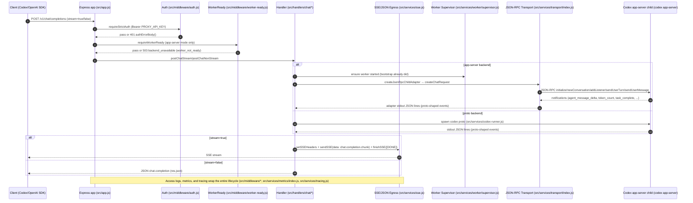

# codex-completions-api — Codebase Audit (Codex App-Server Focus)

## 0. What I analyzed (repo state)

- Current branch: `main` (from `git rev-parse --abbrev-ref HEAD`)
- HEAD commit SHA: `e0263198eaf11d96093dacf1eec8052685ff853b` (from `git rev-parse HEAD`)
- Dirty/clean working tree: **dirty (untracked files present)** (from `git status --porcelain`)
  - Untracked: `.codev/docs/`, `.codev/log/`, `auth/AGENTS.md`, `src/AGENTS.md`, `docs/_archive/review/fix-codex-execution-checklist-v3-commit-review.md`
- Node/runtime/package manager assumptions (repo evidence):
  - Node: `>=22` (`package.json:engines.node`)
  - Package manager: `npm` + lockfile (`package-lock.json`), scripts in `package.json:scripts`
  - Module system: ESM (`package.json:type = "module"`)
  - Runtime imports include a `.ts` module (`src/lib/json-rpc/schema.ts`) from `.js` code (e.g. `src/services/transport/index.js`, `src/handlers/chat/request.js`)

## 1. Executive summary (10–20 bullets)

- The system is an **OpenAI-compatible proxy** that exposes `/v1/chat/completions` (and legacy `/v1/completions`) and shells out to **Codex CLI**, with a preferred **app-server JSON-RPC backend** (`server.js`, `src/services/backend-mode.js`, `src/services/transport/index.js`).
- “Backend app-server” in this repo means a **local child process** launched via `codex app-server …` and communicated with over **newline-delimited JSON-RPC on stdin/stdout** (`src/services/worker/supervisor.js`, `src/services/transport/index.js`).
- Request handling is **layered and explicit**: `server.js` is a thin bootstrap; `src/app.js` owns middleware + routing; route modules delegate to handler modules (`server.js`, `src/app.js`, `src/routes/*`, `src/handlers/*`).
- The proxy is largely **stateless per request**: OpenAI `messages[]` are flattened into a single transcript string and sent as a single user “text item” to the backend (`src/utils.js:joinMessages`, `src/handlers/chat/request.js:buildTranscriptFromMessages`).
- Streaming responses use **SSE** (`data: <json>\n\n` + terminal `[DONE]`) with role-first deltas and optional keepalives (`src/services/sse.js`, `src/handlers/chat/stream.js`).
- `/v1/responses` is implemented as a **translation layer on top of chat**:
  - stream: a stream adapter converts chat chunks → typed Responses SSE events (`src/handlers/responses/stream.js`, `src/handlers/responses/stream-adapter.js`)
  - non-stream: a response transformer converts chat JSON → responses JSON (`src/handlers/responses/nonstream.js`, `src/handlers/chat/nonstream.js:respondWithJson`)
- Observability is a strength: **structured access logs**, **NDJSON trace logging** (sanitized), **Prometheus metrics**, and optional **OpenTelemetry traces** (`src/middleware/access-log.js`, `src/dev-logging.js`, `src/services/metrics/index.js`, `src/services/tracing.js`).
- Security posture is generally strong for a local proxy: bearer auth gates core endpoints (`src/middleware/auth.js`), production guardrails enforce non-default secrets and safe metrics/test settings (`src/services/security-check.js`), and tracing sanitizes headers/bodies (`src/dev-trace/sanitize.js`).
- **Config drift / gaps (P0 hygiene):**
  - `CFG.PROXY_RESPONSES_DEFAULT_MAX_TOKENS` is referenced but **not defined** in `src/config/index.js`, making the fallback path effectively dead (`src/handlers/responses/stream.js`, `src/handlers/responses/nonstream.js`).
  - `PROXY_IDLE_TIMEOUT_MS` is defined but appears **unused in code** (`src/config/index.js`; no `CFG.PROXY_IDLE_TIMEOUT_MS` references found).
  - `PROXY_STREAM_MODE` is set in Docker/systemd/compose but **unused by the current implementation** (no `process.env.PROXY_STREAM_MODE` usage in `src/`; set in `Dockerfile`, `docker-compose.yml`, `compose.dev.stack.yml`, `systemd/codex-openai-proxy.service`).
- Some runtime env reads bypass `src/config/index.js` (risk: drift): e.g. `PROXY_STOP_AFTER_TOOLS_GRACE_MS`, `PROXY_IGNORE_CLIENT_SYSTEM_PROMPT`, `PROXY_TITLE_GEN_INTERCEPT`, `PROXY_APPROVAL_POLICY` (`src/handlers/chat/stream.js`, `src/handlers/chat/request.js`, `src/lib/title-intercept.js`).
- Validation/verification signal from this run (because `node_modules/` exists):
  - `npm run format:check` ✅
  - `npm run lint` ✅
  - `npm run test:unit` ✅ (38 files / 168 tests)
  - `npm run test:integration` ❌ (2 failing tests; details in §3.8 and §8)

## 2. System overview

- What the system does
  - Runs an Express server implementing OpenAI-compatible endpoints (primarily chat completions) and forwards requests to a local Codex backend, shaping output into OpenAI-style JSON or SSE (`server.js`, `src/app.js`, `src/routes/chat.js`, `src/handlers/chat/*`).
- Primary runtime surfaces (server, routes, middleware, adapters)
  - Bootstrap: `server.js` (imports config, security check, backend-mode, worker supervisor, transport handshake, and creates Express app)
  - Express app wiring: `src/app.js:createApp` (global middleware, router mounting, error shaping)
  - Routers: `src/routes/*.js` (mounts `/v1/*`, `/metrics`, `/healthz`, etc.)
  - Handlers: `src/handlers/chat/*`, `src/handlers/responses/*`
  - Backend integration: `src/services/codex-runner.js` (process spawn), `src/services/worker/supervisor.js` (app-server lifecycle), `src/services/transport/index.js` (JSON-RPC transport), `src/services/transport/child-adapter.js` (unifies app-server into “child process” interface)
- What “backend app-server” means in THIS repo (how it is addressed and invoked)
  - It is **not an HTTP upstream**; it is a **child process**:
    - Worker supervisor launches `codex app-server …` (`src/services/worker/supervisor.js:buildSupervisorArgs`, `src/services/codex-runner.js:spawnCodex`).
    - Proxy communicates with the worker over newline-delimited JSON-RPC via stdin/stdout (`src/services/transport/index.js:#write`, `#handleLine`).
    - For request handlers, app-server is exposed via `JsonRpcChildAdapter`, which emits “proto-like” JSON line events on `.stdout` so existing parsers can be reused (`src/services/transport/child-adapter.js:JsonRpcChildAdapter`).
  - In Docker builds, the Codex CLI binary is “baked” from the `@openai/codex` package into `/usr/local/lib/codex-cli` and symlinked, and the image asserts `codex app-server --help` works (`Dockerfile`).

## 3. Architecture map (layered)

### 3.1 Entrypoints / startup

- `server.js`
  - Imports:
    - `src/config/index.js:config` as `CFG`
    - `src/services/security-check.js:assertSecureConfig` (boot-time config guard)
    - `src/services/backend-mode.js:selectBackendMode`, `isAppServerMode`
    - `src/services/worker/supervisor.js:ensureWorkerSupervisor` (starts the app-server worker when enabled)
    - `src/services/transport/index.js:getJsonRpcTransport` (creates transport + triggers handshake)
    - `src/app.js:createApp` (Express app)
  - Startup behavior:
    - Enforces secure prod config (`assertSecureConfig(CFG, process.env)`)
    - Selects backend mode once and logs decision (`selectBackendMode()` in `src/services/backend-mode.js`)
    - If app-server mode, starts supervisor and triggers a best-effort `transport.ensureHandshake()` during startup
    - Listens on `CFG.PORT`, `CFG.PROXY_HOST` (`server.js`)
- `auth/server.mjs` (ForwardAuth service, Traefik integration)
  - Minimal HTTP server with `/healthz` and `/verify` (`auth/server.mjs`)
  - Env-driven: `PORT`, `AUTH_REALM`, `PROXY_API_KEY` (`auth/server.mjs`)
- `auth/server.js` (legacy; exits unless `ALLOW_LEGACY_AUTH=true`) (`auth/server.js`)

### 3.2 HTTP transport, routing, controllers

- `src/app.js:createApp`
  - Global middleware order (important for observability + error shaping):
    1. `metricsMiddleware()` (`src/middleware/metrics.js`)
    2. `tracingMiddleware()` (`src/middleware/tracing.js`)
    3. Global CORS + OPTIONS preflight 204 (`src/app.js` + `src/utils.js:applyCors`)
    4. Structured JSON access log (`src/middleware/access-log.js`)
    5. JSON body parser (`express.json({ limit: "16mb" })`)
    6. Rate-limit middleware (POST-only; specific routes) (`src/middleware/rate-limit.js`)
    7. Router mounting:
       - Metrics (conditional) (`src/routes/metrics.js`)
       - Health (`src/routes/health.js`)
       - Models (`src/routes/models.js`)
       - Chat + legacy completions (`src/routes/chat.js`)
       - Responses (conditional) (`src/routes/responses.js`)
       - Usage (`src/routes/usage.js`)
    8. Two-stage error handlers (body-parser errors → OpenAI JSON, then final JSON fallback) (`src/app.js`)
- Routers (`src/routes/*.js`)
  - `src/routes/chat.js:chatRouter`
    - `/v1/chat/completions` and `/v1/completions` (POST + HEAD)
    - Delegates to `src/handlers/chat/stream.js` + `src/handlers/chat/nonstream.js`
  - `src/routes/responses.js:responsesRouter`
    - `/v1/responses` (POST + HEAD), gated by `CFG.PROXY_ENABLE_RESPONSES`
    - Delegates to `src/handlers/responses/*` which in turn delegates into chat handlers
  - `src/routes/models.js:modelsRouter`: `/v1/models` (GET + HEAD)
  - `src/routes/usage.js:usageRouter`: `/v1/usage`, `/v1/usage/raw` (GET)
  - `src/routes/metrics.js:metricsRouter`: `/metrics` (GET; gated)
  - `src/routes/health.js:healthRouter`: `/healthz`, `/readyz`, `/livez` (GET)

### 3.3 Middleware (auth, validation, limits, transforms)

- Auth
  - `src/middleware/auth.js`
    - `requireStrictAuth` (Bearer token must match `CFG.API_KEY`)
    - `requireUsageAuth`/`requireApiKey` (usage endpoint gating; can allow unauth via `CFG.PROXY_USAGE_ALLOW_UNAUTH`)
    - `requireTestAuth` (requires bearer, and loopback-only unless `CFG.PROXY_TEST_ALLOW_REMOTE`)
  - Bearer parsing helper: `src/lib/bearer.js:bearerToken`
- Worker readiness gate (app-server backend only)
  - `src/middleware/worker-ready.js:requireWorkerReady`
    - If `selectBackendMode() !== BACKEND_APP_SERVER`: pass through
    - Else: if `isWorkerSupervisorReady()`: pass through
    - Else: return `503` `{ error: { type: "backend_unavailable", code: "worker_not_ready", retryable: true }, worker_status: … }`
- Rate limit
  - `src/middleware/rate-limit.js` (token bucket, in-memory, POST-only, guarded paths include `/v1/chat/completions`, `/v1/completions`, `/v1/responses`)
- Metrics middleware
  - `src/middleware/metrics.js` records per-request latency and count, using `src/services/metrics/index.js:observeHttpRequest`
- Tracing middleware
  - `src/middleware/tracing.js` creates an OTel span per request (if enabled), using `src/services/tracing.js:startHttpSpan`
- Access log
  - `src/middleware/access-log.js` emits structured JSON log lines on `res.finish` via `src/services/logging/schema.js:logStructured`

### 3.4 Services / orchestration

- Backend mode selection
  - `src/services/backend-mode.js`
    - `selectBackendMode`, `isAppServerMode`, `isProtoMode`
    - Mode is derived from `CFG.PROXY_USE_APP_SERVER` and logged once
- Codex process runner (proto or app-server)
  - `src/services/codex-runner.js:spawnCodex`
    - Spawns `CFG.CODEX_BIN` with sanitized env (removes `PROXY_API_KEY`, `PROXY_METRICS_TOKEN`)
    - Ensures `CFG.PROXY_CODEX_WORKDIR` exists
- App-server worker supervisor
  - `src/services/worker/supervisor.js:ensureWorkerSupervisor`
    - Supervises a long-lived `codex app-server` child; restarts with backoff (`WORKER_*` config)
    - Tracks readiness, liveness, last exit, restart metadata and exposes snapshots via `getWorkerStatus`
    - Notable: `recordHandshakeSuccess` sets `this.state.ready = true` (handshake completion can make the worker “ready”)
- JSON-RPC transport (app-server)
  - `src/services/transport/index.js:getJsonRpcTransport`
    - Guards usage: throws if app-server mode disabled
    - `JsonRpcTransport.ensureHandshake()` sends `initialize` RPC
    - Per-request orchestration: `createChatRequest` → `newConversation` → `addConversationListener` → `sendUserTurn` + `sendUserMessage`
    - Notification handling routes worker events to a `RequestContext` emitter (`#handleNotification`)
- SSE utilities
  - `src/services/sse.js` sets headers, emits SSE `data:` frames, emits terminal `[DONE]`
- Concurrency guard
  - `src/services/concurrency-guard.js` provides a global semaphore to cap simultaneous SSE streams (`setupStreamGuard`, `guardSnapshot`)
- Security guardrails
  - `src/services/security-check.js:assertSecureConfig` fails fast in prod-like modes if API key is default, test endpoints enabled, or metrics are insecure

### 3.5 Adapters / integrations (app-server client, OpenAI compatibility translation, etc.)

- OpenAI request normalization → app-server payload
  - `src/handlers/chat/request.js:normalizeChatJsonRpcRequest`
    - Validates optional fields (temperature/top_p/max_tokens/tools/tool_choice/etc.)
    - Builds a `turn` payload (sandbox, cwd, approval policy, choiceCount, tools) and a `message` payload (items, includeUsage, responseFormat, reasoning, etc.)
    - Builds transcripts from `messages[]` and tool/function roles (`buildTranscriptFromMessages`)
    - Can ignore client system prompts by default via `PROXY_IGNORE_CLIENT_SYSTEM_PROMPT` (`IGNORE_CLIENT_SYSTEM_PROMPT`)
- App-server adapter to “child process” interface
  - `src/services/transport/child-adapter.js:JsonRpcChildAdapter`
    - Accepts the same “submission line” that proto mode uses (`{ op: { items:[{text}] } }`)
    - Creates a `RequestContext` via transport, wires notifications into `.stdout` as JSON lines
    - Enables reusing the same stdout-line parsers in `src/handlers/chat/stream.js` and `src/handlers/chat/nonstream.js`
- Tool-call aggregation and output modes
  - `src/lib/tool-call-aggregator.js:createToolCallAggregator`
    - Normalizes tool_calls/function_call deltas across variant payload shapes
    - Also parses `<use_tool …>` blocks from plain text output and converts them into structured tool calls
  - Output shaping is influenced by `x-proxy-output-mode` and `CFG.PROXY_OUTPUT_MODE` (`src/handlers/chat/shared.js:resolveOutputMode`)
- Responses API translation
  - `src/handlers/responses/stream-adapter.js:createResponsesStreamAdapter` intercepts chat stream chunks and emits typed Responses SSE (`event: response.*`)
  - `src/handlers/responses/shared.js:convertChatResponseToResponses` maps chat JSON → responses JSON for non-streaming
- Title generation intercept
  - `src/lib/title-intercept.js:maybeHandleTitleIntercept` can short-circuit certain “generate a concise title” prompts into a deterministic result

### 3.6 Data/storage (if any)

- No database. Primary persistence is file-based NDJSON logs in temp paths:
  - Usage: `src/dev-logging.js:TOKEN_LOG_PATH` (default `/tmp/codex-usage.ndjson`)
    - Read by `/v1/usage` and `/v1/usage/raw` (`src/routes/usage.js:loadUsageEvents`)
  - Trace/proto events: `src/dev-logging.js:PROTO_LOG_PATH` (default `/tmp/codex-proto-events.ndjson`)
  - Sanitizer telemetry: `src/dev-logging.js:SANITIZER_LOG_PATH` (base dir constrained by `SANITIZER_LOG_BASE_DIR`, default `/tmp`)

### 3.7 Observability (logs/metrics/traces)

- Structured logs (stdout)
  - `src/services/logging/schema.js:logStructured` (redacts `payload/body/headers/messages/response` keys)
  - Access logs with request IDs and Copilot trace IDs: `src/middleware/access-log.js`
- Dev trace logging (NDJSON)
  - HTTP ingress: `src/dev-trace/http.js:logHttpRequest` (sanitizes headers/body via `src/dev-trace/sanitize.js`)
  - Backend JSON-RPC I/O: `src/dev-trace/backend.js:{logBackendSubmission,logBackendNotification,logBackendResponse}`
  - Client SSE/JSON egress: `src/services/sse.js:{sendSSE,finishSSE,logJsonResponse}` via `appendProtoEvent`
- Prometheus metrics (`prom-client`)
  - Registry + metrics: `src/services/metrics/index.js` exposed at `/metrics` (`src/routes/metrics.js`)
  - Includes HTTP latency, stream TTFB/duration/outcomes, worker restarts/readiness, tool-buffer anomaly, typed Responses SSE event counters
- OpenTelemetry tracing (optional)
  - `src/services/tracing.js` (enabled via `PROXY_ENABLE_OTEL`/`OTEL_ENABLED` and `PROXY_OTEL_EXPORTER_URL`/`OTEL_EXPORTER_OTLP_ENDPOINT`)

### 3.8 Tests & tooling

- Test layout
  - Unit tests: `tests/unit/**` (Vitest) (`package.json:scripts.test:unit`)
  - Integration tests: `tests/integration/**` (Vitest) (`package.json:scripts.test:integration`)
  - Playwright E2E: `tests/e2e/**` + `tests/*.spec.js` (`package.json:scripts.test`)
  - Deterministic backend shims: `scripts/fake-codex-jsonrpc.js`, `scripts/fake-codex-proto*.js` (referenced heavily by integration tests)
- Tooling and gates
  - Format: Prettier (`package.json:scripts.format:check`)
  - Lint: ESLint flat config (`eslint.config.mjs`, `package.json:scripts.lint`)
  - JSON-RPC schema bundle: `scripts/jsonrpc/export-json-schema.mjs` (`package.json:scripts.jsonrpc:bundle/verify`)
- Evidence from this run (no installs performed; `node_modules/` already present)
  - `npm run format:check` ✅
  - `npm run lint` ✅
  - `npm run test:unit` ✅
  - `npm run test:integration` ❌ with two failures:
    - `tests/integration/chat-jsonrpc.int.test.js` expects `newConversationParams.baseInstructions` to include the client system prompt, but `src/handlers/chat/request.js` defaults `PROXY_IGNORE_CLIENT_SYSTEM_PROMPT` to `"true"`, causing `baseInstructions` to be omitted.
    - `tests/integration/responses.readiness.int.test.js` expects `503` when `FAKE_CODEX_SKIP_READY=true`, but `server.js` triggers a background `transport.ensureHandshake()` and `src/services/worker/supervisor.js:recordHandshakeSuccess` sets `state.ready = true`, which can satisfy `src/middleware/worker-ready.js` even if the fake worker never emits a “ready” log line.

## 4. Request/Response flow maps (ingress → app-server → egress)

### 4.1 One high-level Mermaid sequence diagram



### 4.2 Endpoint-by-endpoint flow breakdown

#### Global: `OPTIONS *` (CORS preflight)

- Route pattern + method(s)
  - Any route with `OPTIONS` is handled globally in `src/app.js` before routers mount.
- Handler entry file(s) and exported handler symbol names
  - `src/app.js:createApp` inline middleware: returns `204` for `OPTIONS`.
- Middleware chain (in order) and what each step does
  - `metricsMiddleware` → `tracingMiddleware` → **CORS middleware** (applies headers) → if `OPTIONS` → `204`.
- Request normalization/transforms
  - No body parsing required (happens after).
- Streaming/SSE behavior
  - None.
- Error shaping
  - None (direct `204`).
- Observability points
  - Access log still runs for OPTIONS (since accessLog middleware comes after CORS middleware but before JSON parsing).

#### `HEAD /v1/chat/completions` and `HEAD /v1/completions`

- Route pattern + method(s)
  - `HEAD` on `["/v1/chat/completions", "/v1/completions"]` (`src/routes/chat.js`)
- Handler entry + symbol
  - `src/routes/chat.js:chatRouter` inline handler
- Middleware chain
  - Global middleware (metrics/tracing/CORS/access-log/body-parser/rate-limit) → `requireStrictAuth` (`src/middleware/auth.js`) → handler
- Response behavior
  - `200` with `Content-Type: application/json; charset=utf-8` (`src/routes/chat.js`)
- Observability
  - Access log (`src/middleware/access-log.js`), HTTP metrics (`src/middleware/metrics.js`), optional tracing (`src/middleware/tracing.js`)

#### `POST /v1/chat/completions` (streaming and non-streaming)

- Route pattern + method(s)
  - `POST /v1/chat/completions` (`src/routes/chat.js`)
- Handler entry file(s) + symbols
  - Router: `src/routes/chat.js:chatRouter`
  - Streaming: `src/handlers/chat/stream.js:postChatStream`
  - Non-streaming: `src/handlers/chat/nonstream.js:postChatNonStream`
- Middleware chain (in order)
  - Global: `metricsMiddleware` → `tracingMiddleware` → CORS+OPTIONS → `accessLog` → `express.json` → `rateLimit`
  - Route: `requireStrictAuth` → `maybeHandleTitleIntercept` → `requireWorkerReady` → handler
- Request normalization/transforms
  - Determines stream mode:
    - If `body.stream` provided, uses it; else uses `CFG.PROXY_DEFAULT_STREAM` (`src/routes/chat.js`)
  - Model resolution and validation:
    - `requireModel` enforces presence of `model` (returns `invalidRequestBody("model", …)`) (`src/handlers/chat/require-model.js`)
    - `normalizeModel` maps public IDs to effective model (`src/utils.js:normalizeModel`, `src/config/models.js`)
    - Rejects unknown models with `modelNotFoundBody` (`src/lib/errors.js`)
  - Optional param validation:
    - `validateOptionalChatParams` rejects unsupported `logprobs`, `top_logprobs`, and (depending on backend) constrains `response_format` (`src/handlers/chat/shared.js`)
  - Prompt/transcript shaping:
    - Proto-mode uses `src/utils.js:joinMessages` to build a prompt string.
    - App-server mode uses `src/handlers/chat/request.js:normalizeChatJsonRpcRequest`, which builds:
      - `turn` payload: sandbox policy, cwd, approval policy, stream flag, tools definitions, choiceCount, baseInstructions
      - `message` payload: items + includeUsage + responseFormat/reasoning/tools/etc.
    - System prompt inclusion is gated by `PROXY_IGNORE_CLIENT_SYSTEM_PROMPT` (default `"true"`) (`src/handlers/chat/request.js`)
- Outbound request construction to app-server (URL, payload shaping, headers)
  - No HTTP URL; local JSON-RPC over stdio.
  - App-server path:
    - Handler creates `JsonRpcChildAdapter` (`src/services/transport/child-adapter.js:createJsonRpcChildAdapter`)
    - Adapter calls transport: `ensureHandshake` → `newConversation` → `addConversationListener` → `sendUserTurn` → `sendUserMessage` (`src/services/transport/index.js`)
  - Proto path:
    - Handler spawns Codex CLI process with args from `buildBackendArgs` (`src/handlers/chat/shared.js`, `src/services/codex-runner.js`)
- Streaming/SSE behavior (when `stream=true`)
  - SSE headers: `src/services/sse.js:setSSEHeaders`
  - Frames:
    - Role-first `chat.completion.chunk` delta (`src/handlers/chat/stream.js:sendRoleOnce`)
    - Content deltas: parsed from backend JSON line events (`agent_message_delta`, `agent_message`, etc.) and emitted as SSE data frames (`src/handlers/chat/stream.js:child.stdout.on("data")` parsing loop)
    - Finish chunk: emits `finish_reason` and terminates with `[DONE]` (`src/handlers/chat/stream.js:emitFinishChunk`, `src/services/sse.js:finishSSE`)
  - Keepalives:
    - Configured by `CFG.PROXY_SSE_KEEPALIVE_MS` and suppressed for some UAs/headers (`src/services/sse.js:computeKeepaliveMs`)
  - Backpressure:
    - Implementation writes to `res.write` without checking return value; concurrency is capped by `PROXY_SSE_MAX_CONCURRENCY` (`src/services/concurrency-guard.js`)
- Non-stream response behavior (when `stream=false`)
  - Aggregates stdout line events into final `chat.completion` JSON and returns via `res.json` (`src/handlers/chat/nonstream.js:finalizeResponse`)
  - Uses `res.locals.responseTransform` for `/v1/responses` translation (`src/handlers/chat/nonstream.js:respondWithJson`)
- Tool-call loops, tool parsing, “stop-after-tools”
  - Tool call aggregation:
    - Structured tool deltas from payloads: `src/lib/tool-call-aggregator.js`
    - Textual `<use_tool>` blocks: parsed and converted into `tool_calls[]` (same file)
  - “Stop after tools”:
    - Controlled by `CFG.PROXY_STOP_AFTER_TOOLS`, `CFG.PROXY_STOP_AFTER_TOOLS_MODE`, `CFG.PROXY_TOOL_BLOCK_MAX`, and `process.env.PROXY_STOP_AFTER_TOOLS_GRACE_MS` (`src/handlers/chat/stream.js`)
    - Enforced by `src/handlers/chat/stop-after-tools-controller.js:createStopAfterToolsController`
  - Tool buffer:
    - Buffers partial `<use_tool>` blocks in streaming mode to avoid emitting malformed fragments (`src/handlers/chat/tool-buffer.js`)
- Error shaping
  - Auth failures: `401` with `authErrorBody()` (`src/middleware/auth.js`, `src/lib/errors.js`)
  - Worker not ready (app-server mode): `503` `backend_unavailable` (`src/middleware/worker-ready.js`)
  - Concurrency exceeded: `429` `rate_limit_error` (`src/services/concurrency-guard.js`, `src/handlers/chat/stream.js`)
  - Backend transport errors (app-server): mapped via `src/services/transport/index.js:mapTransportError`
  - Body-parser errors: OpenAI-style JSON (invalid_json, request_entity_too_large, etc.) (`src/app.js`)
- Observability points
  - Ingress: `src/dev-trace/http.js:logHttpRequest` (sanitized)
  - Backend I/O: `src/dev-trace/backend.js` (sanitized JSON-RPC payloads)
  - Egress: `src/services/sse.js` logs every SSE payload and `[DONE]` marker to proto events
  - Metrics: `src/middleware/metrics.js` + streaming observer `src/services/metrics/index.js:createStreamObserver`
  - Usage NDJSON logging: `src/dev-logging.js:appendUsage` called from both stream and non-stream handlers

#### `POST /v1/completions` (legacy OpenAI completions shim)

- Route pattern + methods
  - `POST /v1/completions` (stream and non-stream) (`src/routes/chat.js`)
- Handler entry + symbols
  - Streaming: `src/handlers/chat/stream.js:postCompletionsStream`
  - Non-stream: `src/handlers/chat/nonstream.js:postCompletionsNonStream`
- Key behaviors
  - Normalizes `prompt` into a single user message and uses the same backend invocation patterns as chat (`src/handlers/chat/nonstream.js:postCompletionsNonStream`)
  - Streaming returns SSE `text_completion` deltas (legacy shape) (`src/handlers/chat/stream.js:postCompletionsStream`)
- Error shaping and observability
  - Same auth/rate-limit/worker-ready behavior as chat (shared middleware in routers/app)

#### `GET/HEAD /v1/models`

- Route pattern + methods
  - `GET ["/v1/models", "/v1/models/"]`, `HEAD ["/v1/models", "/v1/models/"]` (`src/routes/models.js`)
- Handler entry + symbol
  - `src/routes/models.js:modelsRouter`
- Middleware chain
  - Global middleware + route handler (no shared auth middleware)
  - Optional gating:
    - If `CFG.PROTECT_MODELS` is true, it enforces bearer token inline (`src/routes/models.js:gated`)
- Response behavior
  - Returns `{ object: "list", data: [{ id, object:"model", owned_by:"codex"…}] }` from `publicModelIds` (`src/config/models.js`)
- Observability
  - Access logs + metrics as usual

#### `POST/HEAD /v1/responses` (OpenAI Responses compatibility surface)

- Route pattern + methods
  - `HEAD /v1/responses`, `POST /v1/responses` (`src/routes/responses.js`)
- Handler entry + symbols
  - Router: `src/routes/responses.js:responsesRouter`
  - Stream: `src/handlers/responses/stream.js:postResponsesStream` (delegates into `postChatStream`)
  - Non-stream: `src/handlers/responses/nonstream.js:postResponsesNonStream` (delegates into `postChatNonStream`)
- Middleware chain
  - Global middleware → `requireStrictAuth`
  - HEAD: `requireWorkerReady` then `200`
  - POST: title intercept → `requireWorkerReady` → handler
- Request normalization/transforms
  - `coerceInputToChatMessages` builds chat `messages[]` from Responses `input`/`instructions` (`src/handlers/responses/shared.js`)
  - Applies default output mode header using `CFG.PROXY_RESPONSES_OUTPUT_MODE` if none set (`src/handlers/responses/shared.js:applyDefaultProxyOutputModeHeader`)
  - Stream adapter:
    - `res.locals.streamAdapter = createResponsesStreamAdapter(res, originalBody)` (`src/handlers/responses/stream.js`)
    - `postChatStream` calls adapter `onChunk`/`onDone` hooks (`src/handlers/chat/stream.js:invokeAdapter`)
  - Non-stream transformer:
    - `res.locals.responseTransform = transform(payload,status)` to map chat completion → responses JSON (`src/handlers/responses/nonstream.js`)
- Outbound request construction
  - Ultimately identical to chat path because it delegates into chat handlers.
- Streaming behavior
  - Emits typed SSE events like `response.created`, `response.output_text.delta`, `response.completed`, and terminal `done: [DONE]` (`src/handlers/responses/stream-adapter.js`)
- Error shaping
  - Shares the chat handlers’ underlying error shapes for backend and request errors; non-stream adapter includes a catch-all to avoid double-writes (`src/handlers/responses/nonstream.js`)
- Observability
  - Logs ingress summaries without leaking secrets (`src/handlers/responses/ingress-logging.js`)
  - Records typed SSE event counts (`src/services/metrics/index.js:recordResponsesSseEvent`)

#### `GET /v1/usage` and `GET /v1/usage/raw`

- Route pattern + methods
  - `GET /v1/usage`, `GET /v1/usage/raw` (`src/routes/usage.js`)
- Handler entry + symbol
  - `src/routes/usage.js:usageRouter`
- Middleware chain
  - Global middleware → `requireApiKey` (alias of `requireUsageAuth`) (`src/middleware/auth.js`)
- Data sources
  - Reads NDJSON from `TOKEN_LOG_PATH` (`src/dev-logging.js`) and aggregates with `src/utils.js:aggregateUsage`
- Response behavior
  - Adds tool-buffer metrics summary via `src/services/metrics/chat.js:toolBufferMetrics`

#### `GET /metrics`

- Route pattern + method(s)
  - `GET /metrics` (`src/routes/metrics.js`)
- Auth gating
  - Controlled by:
    - `CFG.PROXY_METRICS_ALLOW_UNAUTH`
    - or `CFG.PROXY_METRICS_TOKEN` bearer
    - or loopback allowlist if `CFG.PROXY_METRICS_ALLOW_LOOPBACK`
  - (`src/routes/metrics.js:isMetricsAuthorized`)
- Response behavior
  - Emits Prometheus text format (`src/services/metrics/index.js:renderMetrics`)

#### `GET /healthz`, `GET /readyz`, `GET /livez`

- Route pattern + method(s)
  - `GET /healthz`, `GET /readyz`, `GET /livez` (`src/routes/health.js`)
- Behavior
  - Returns snapshots of backend mode and worker supervisor health (`src/routes/health.js:buildWorkerSnapshots`, `src/services/worker/supervisor.js:getWorkerStatus`)
  - In non-app-server mode, readiness/liveness are forced “ok” with `reason: "app_server_disabled"` (`src/routes/health.js`)

#### Test-only endpoints (if `CFG.PROXY_TEST_ENDPOINTS=true`)

- Route patterns
  - Mounted at `/__test` in `src/app.js`
  - `/__test/conc`, `/__test/conc/release`, `/__test/tool-buffer-metrics`, `/__test/tool-buffer-metrics/reset`
- Auth gating
  - `requireTestAuth` requires bearer and loopback-only unless `CFG.PROXY_TEST_ALLOW_REMOTE` (`src/middleware/auth.js`)
- Notes
  - `/__test/conc/release` writes to `process.env.STREAM_RELEASE_FILE` (test harness only) (`src/app.js`)

## 5. Configuration & feature-flag audit (Codex app-server minimal set)

### 5.1 Full inventory table (env vars / config flags)

Notes on “defaults”:
- Defaults below are taken from `src/config/index.js` when present, otherwise from the module that reads `process.env` directly.
- Some flags exist in infra configs but are not read by the current proxy implementation; those are called out as “unused/drift”.

| Name | Default | Where defined (file + symbol) | Where used (file + symbol) | Affects (feature/endpoint) | Required for Codex→app-server core path? (Y/N) | Notes / risk |
|---|---:|---|---|---|:---:|---|
| `PORT` | `11435` | `src/config/index.js:config.PORT` | `server.js` (listen) | Server bind | Y | Docker/systemd/compose override this frequently (`Dockerfile`, `docker-compose.yml`, `systemd/codex-openai-proxy.service`). |
| `PROXY_HOST` / `PROXY_HOST` | `"127.0.0.1"` | `src/config/index.js:config.PROXY_HOST` | `server.js` (listen) | Server bind host | Y | `docker-compose.yml` sets `0.0.0.0` for container listen. |
| `PROXY_API_KEY` | `"codex-local-secret"` | `src/config/index.js:config.API_KEY` | `src/middleware/auth.js:{requireStrictAuth,requireTestAuth}` | Auth for `/v1/chat/completions`, `/v1/completions`, `/v1/responses`, `/v1/usage*`, tests | Y | In prod-like env, default value causes startup failure (`src/services/security-check.js`). |
| `PROXY_ENV` | `""` | `src/config/index.js:config.PROXY_ENV` | Many (e.g. `src/dev-logging.js`, chat handlers) | Dev-only logging/behavior gates | N | Empty means “prod-like” is inferred from `NODE_ENV` in `assertSecureConfig` (`src/services/security-check.js`). |
| `PROXY_USE_APP_SERVER` | derived (`true` unless `CODEX_BIN` looks proto-shim) | `src/config/index.js:config.PROXY_USE_APP_SERVER` | `src/services/backend-mode.js:resolveBackendMode` | Chooses app-server JSON-RPC vs proto backend | Y | `server.js` starts supervisor + handshake only when this resolves true. |
| `CODEX_BIN` | `"codex"` | `src/config/index.js:config.CODEX_BIN` | `src/services/codex-runner.js:resolvedCodexBin` | Backend executable | Y | In Docker image, points to baked `/usr/local/lib/codex-cli/bin/codex.js` (`Dockerfile`). |
| `CODEX_HOME` | `<repo>/.codex-api` | `src/config/index.js:config.CODEX_HOME` | `src/services/codex-runner.js` | Codex CLI home (config/secrets/rollouts) | Y | `.codex-api/` is intentionally gitignored (`.gitignore`). |
| `CODEX_MODEL` | `"gpt-5"` | `src/config/index.js:config.CODEX_MODEL` | Routes + handlers + supervisor args | Default model mapping | Y | Public model IDs map to target models in `src/config/models.js`. |
| `CODEX_FORCE_PROVIDER` | `""` | `src/config/index.js:config.CODEX_FORCE_PROVIDER` | Worker args + backend args | Forces model provider | N | Set to empty explicitly in docker-compose to avoid pinning (`docker-compose.yml`). |
| `PROXY_SANDBOX_MODE` | `"read-only"` | `src/config/index.js:config.PROXY_SANDBOX_MODE` | Worker args + JSON-RPC turn sandboxPolicy | Sandbox policy passed to Codex | Y | Passed as `sandbox_mode` in supervisor args (`src/services/worker/supervisor.js`). |
| `PROXY_CODEX_WORKDIR` | `os.tmpdir()/codex-work` | `src/config/index.js:config.PROXY_CODEX_WORKDIR` | `src/services/codex-runner.js` + JSON-RPC `cwd` | Backend working directory | Y | Used as `cwd` in app-server `turn` (`src/handlers/chat/request.js`). |
| `PROXY_APPROVAL_POLICY` | `"never"` | `src/handlers/chat/stream.js` (local constant) | `src/handlers/chat/request.js` (passed as `approvalPolicy`) | App-server tool approval policy | Y (for app-server) | Not centralized in `src/config/index.js` (drift risk). Alias: `CODEX_APPROVAL_POLICY`. |
| `CODEX_APPROVAL_POLICY` | `"never"` | same as above | same | same | Y (for app-server) | Used as fallback if `PROXY_APPROVAL_POLICY` unset (`src/handlers/chat/stream.js`, `src/handlers/chat/nonstream.js`). |
| `PROXY_IGNORE_CLIENT_SYSTEM_PROMPT` | `"true"` | `src/handlers/chat/request.js:IGNORE_CLIENT_SYSTEM_PROMPT` | `normalizeChatJsonRpcRequest` | Whether to forward `system`/`developer` messages to app-server base instructions | N | Default currently causes `baseInstructions` to be omitted; this appears to be in tension with `tests/integration/chat-jsonrpc.int.test.js`. |
| `PROXY_TITLE_GEN_INTERCEPT` | `"true"` | `src/lib/title-intercept.js:TITLE_INTERCEPT_ENABLED` | `src/routes/chat.js`, `src/routes/responses.js` | Title-generation short-circuit for chat/responses | N | Can bypass worker readiness for matching prompts (still behind auth). |
| `PROXY_ENABLE_RESPONSES` | `"true"` | `src/config/index.js:config.PROXY_ENABLE_RESPONSES` | `src/app.js` router mount | Enables `/v1/responses` | N | Disable to reduce surface area if not needed. |
| `PROXY_RESPONSES_OUTPUT_MODE` | `"openai-json"` | `src/config/index.js:config.PROXY_RESPONSES_OUTPUT_MODE` | `src/handlers/responses/{stream,nonstream}.js` | Default `x-proxy-output-mode` for `/v1/responses` | N | Controls translation behavior in responses adapter. |
| `PROXY_RESPONSES_DEFAULT_MAX_TOKENS` | **undefined → effectively `0`** | **missing from `src/config/index.js`** | `src/handlers/responses/{stream,nonstream}.js` | Intended fallback max_tokens for `/v1/responses` | N | P0 drift: referenced via `CFG.*` but not defined; fallback path never activates. |
| `PROXY_DEFAULT_STREAM` | `"false"` | `src/config/index.js:config.PROXY_DEFAULT_STREAM` | `src/routes/chat.js` | Default streaming when client omits `stream` | N | `compose.dev.stack.yml` sets it true for dev. |
| `PROXY_TIMEOUT_MS` | `300000` | `src/config/index.js:config.PROXY_TIMEOUT_MS` | Chat handlers (request timeout) | Backend request timeout | Y | Kills backend on timeout (`src/handlers/chat/stream.js`, `src/handlers/chat/nonstream.js`). |
| `PROXY_STREAM_IDLE_TIMEOUT_MS` | `300000` | `src/config/index.js:config.PROXY_STREAM_IDLE_TIMEOUT_MS` | `src/handlers/chat/stream.js` | Stream idle kill timer | N | Tracks finish reason `length` on idle (`src/handlers/chat/stream.js:resetStreamIdle`). |
| `PROXY_PROTO_IDLE_MS` | `120000` | `src/config/index.js:config.PROXY_PROTO_IDLE_MS` | `src/handlers/chat/nonstream.js` | Non-stream “proto idle” timer | N | Enforces idle timeout between backend output chunks. |
| `PROXY_IDLE_TIMEOUT_MS` | `15000` | `src/config/index.js:config.PROXY_IDLE_TIMEOUT_MS` | **unused (no CFG usage)** | — | N | P0 drift: defined and set in compose, but not referenced. |
| `PROXY_SSE_KEEPALIVE_MS` | `15000` | `src/config/index.js:config.PROXY_SSE_KEEPALIVE_MS` | `src/services/sse.js` | Keepalive cadence | N | Can be disabled per UA/header/query (`src/services/sse.js:computeKeepaliveMs`). |
| `PROXY_SSE_MAX_CONCURRENCY` | `4` | `src/config/index.js:config.PROXY_SSE_MAX_CONCURRENCY` | `src/handlers/chat/stream.js` | Concurrency cap for SSE streams | N | Guard headers only exposed when `PROXY_TEST_ENDPOINTS=true` (`src/services/concurrency-guard.js`). |
| `PROXY_KILL_ON_DISCONNECT` | `"false"` | `src/config/index.js:config.PROXY_KILL_ON_DISCONNECT` | chat handlers | Whether to SIGTERM backend when client disconnects | N | Stored as string; handlers treat `"false"` specially. |
| `PROXY_ENABLE_CORS` | `"true"` | `src/config/index.js:config.PROXY_ENABLE_CORS` | `src/app.js` + others | CORS headers and preflight behavior | N | Default allowlist is `"*"` which mirrors the request origin and sets credentials. Validate threat model for browser usage. |
| `PROXY_CORS_ALLOWED_ORIGINS` | `"*"` | `src/config/index.js:config.PROXY_CORS_ALLOWED_ORIGINS` | `src/utils.js:applyCors` (via callers) | Allowed origins | N | `docker-compose.yml` uses explicit allowlist. |
| `PROXY_LOG_CORS_ORIGIN` | `"false"` | `src/config/index.js:config.PROXY_LOG_CORS_ORIGIN` | `src/app.js` | Logs preflight metadata | N | Uses `logStructured` (payload redacted). |
| `PROXY_RATE_LIMIT_ENABLED` | `"false"` | `src/config/index.js:config.PROXY_RATE_LIMIT_ENABLED` | `src/app.js` | Enables POST rate limiter | N | In-memory only; edge rate limiting still recommended. |
| `PROXY_RATE_LIMIT_WINDOW_MS` | `60000` | `src/config/index.js:config.PROXY_RATE_LIMIT_WINDOW_MS` | `src/app.js` | Rate limit window | N | — |
| `PROXY_RATE_LIMIT_MAX` | `60` | `src/config/index.js:config.PROXY_RATE_LIMIT_MAX` | `src/app.js` | Rate limit burst cap | N | — |
| `PROXY_MAX_PROMPT_TOKENS` | `0` | `src/config/index.js:config.PROXY_MAX_PROMPT_TOKENS` | Chat handlers | Rejects large prompts | N | `0` disables the guard. |
| `PROXY_MAX_CHAT_CHOICES` | `5` | `src/config/index.js:config.PROXY_MAX_CHAT_CHOICES` | Chat + Responses handlers | Max `n` choices | N | Validated in stream and non-stream. |
| `PROXY_OUTPUT_MODE` | `"obsidian-xml"` | `src/config/index.js:config.PROXY_OUTPUT_MODE` | Chat handlers | Output shaping for tool calls/content | N | Can be overridden per request via `x-proxy-output-mode` (`src/handlers/chat/shared.js`). |
| `PROXY_TOOL_BLOCK_MAX` | `0` | `src/config/index.js:config.PROXY_TOOL_BLOCK_MAX` | Stream/non-stream tool-call shaping | Tool block truncation | N | Also influences stop-after-tools enforcement. |
| `PROXY_STOP_AFTER_TOOLS` | `false` | `src/config/index.js:config.PROXY_STOP_AFTER_TOOLS` | `src/handlers/chat/stream.js` | Enforce stop-after-tools | N | Default is false (boolish). |
| `PROXY_STOP_AFTER_TOOLS_MODE` | `"burst"` | `src/config/index.js:config.PROXY_STOP_AFTER_TOOLS_MODE` | `src/handlers/chat/stream.js` | Stop-after-tools mode | N | `"first"` forces immediate cutoff on first tool. |
| `PROXY_STOP_AFTER_TOOLS_GRACE_MS` | `300` | `src/handlers/chat/stream.js` (direct env read) | stop-after-tools controller | Tool cutoff grace delay | N | Not centralized in config (drift risk). |
| `PROXY_SUPPRESS_TAIL_AFTER_TOOLS` | `false` | `src/config/index.js:config.PROXY_SUPPRESS_TAIL_AFTER_TOOLS` | stream tool buffer logic | Suppress assistant tail | N | Used to clamp emit boundaries when tools present. |
| `PROXY_TOOL_BLOCK_DEDUP` | `false` | `src/config/index.js:config.PROXY_TOOL_BLOCK_DEDUP` | non-stream assistant message building | Dedup tool blocks | N | Only used in non-stream building helpers (`src/handlers/chat/nonstream.js`). |
| `PROXY_TOOL_BLOCK_DELIMITER` | `""` | `src/config/index.js:config.PROXY_TOOL_BLOCK_DELIMITER` | non-stream tool block join | Tool block join delimiter | N | Special parsing: `"true"` → `\\n\\n`, `"false"`/empty → `""`. |
| `PROXY_SANITIZE_METADATA` | `false` | `src/config/index.js:config.PROXY_SANITIZE_METADATA` | chat + responses handlers | Output metadata sanitizer | N | Removes known metadata lines from streamed text (`src/lib/metadata-sanitizer.js`). |
| `PROXY_INGRESS_GUARDRAIL` | `true` | `src/config/index.js:config.PROXY_INGRESS_GUARDRAIL` | chat handlers | Injects a system guardrail prompt when transcript markers detected | N | Helps mitigate “tool transcript injection” (`src/lib/ingress-guardrail.js`). |
| `PROXY_ENABLE_PARALLEL_TOOL_CALLS` | `false` | `src/config/index.js:config.PROXY_ENABLE_PARALLEL_TOOL_CALLS` | worker args + request normalization | Enables parallel tool calls | N | Only enabled in dev env in handlers (`src/handlers/chat/stream.js`). |
| `PROXY_TEST_ENDPOINTS` | `false` | `src/config/index.js:config.PROXY_TEST_ENDPOINTS` | `src/app.js` | Mounts `/__test/*` | N | Disallowed in prod-like env (`src/services/security-check.js`). |
| `PROXY_TEST_ALLOW_REMOTE` | `false` | `src/config/index.js:config.PROXY_TEST_ALLOW_REMOTE` | `src/middleware/auth.js:requireTestAuth` | Allows remote test endpoints | N | Should remain false in prod. |
| `PROXY_USAGE_ALLOW_UNAUTH` | `false` | `src/config/index.js:config.PROXY_USAGE_ALLOW_UNAUTH` | `src/middleware/auth.js:requireUsageAuth` | Makes `/v1/usage*` public | N | Risky in prod; keep false. |
| `PROTECT_MODELS` / `PROXY_PROTECT_MODELS` | `false` | `src/config/index.js:config.PROTECT_MODELS` | `src/routes/models.js:gated` | Auth gate for `/v1/models` | N | Traefik config also publishes models publicly (`docker-compose.yml` labels). |
| `PROXY_ENABLE_METRICS` | `false` | `src/config/index.js:config.PROXY_ENABLE_METRICS` | `src/app.js` | Mounts `/metrics` | N | In prod-like env, insecure metrics config fails boot (`src/services/security-check.js`). |
| `PROXY_METRICS_ALLOW_UNAUTH` | `false` | `src/config/index.js:config.PROXY_METRICS_ALLOW_UNAUTH` | `src/routes/metrics.js` | Public metrics | N | Use bearer or loopback instead. |
| `PROXY_METRICS_ALLOW_LOOPBACK` | `true` | `src/config/index.js:config.PROXY_METRICS_ALLOW_LOOPBACK` | `src/routes/metrics.js` | Loopback metrics allow | N | — |
| `PROXY_METRICS_TOKEN` | `""` | `src/config/index.js:config.PROXY_METRICS_TOKEN` | `src/routes/metrics.js` | Bearer auth for metrics | N | Keep secret; never log. |
| `PROXY_MAINTENANCE_MODE` | `false` | `src/config/index.js:config.PROXY_MAINTENANCE_MODE` | `src/routes/metrics.js` | Metrics gauge only | N | No behavioral gating elsewhere (potential no-op flag). |
| `WORKER_MAX_CONCURRENCY` | `4` | `src/config/index.js:config.WORKER_MAX_CONCURRENCY` | `src/services/transport/index.js:createChatRequest` | Limits concurrent requests into worker | Y | Enforced as `worker_busy` (`429`) transport error mapping. |
| `WORKER_REQUEST_TIMEOUT_MS` | `120000` | `src/config/index.js:config.WORKER_REQUEST_TIMEOUT_MS` | `src/services/transport/index.js` | JSON-RPC request timeout | Y | Affects both turn and message RPC timeouts. |
| `WORKER_HANDSHAKE_TIMEOUT_MS` | `15000` | `src/config/index.js:config.WORKER_HANDSHAKE_TIMEOUT_MS` | `src/services/transport/index.js:ensureHandshake` | Initialize timeout | Y | Mapped to `503 backend_unavailable` (`handshake_timeout`). |
| `WORKER_STARTUP_TIMEOUT_MS` | `8000` | `src/config/index.js:config.WORKER_STARTUP_TIMEOUT_MS` | `src/services/worker/supervisor.js:waitForReady` | Worker startup wait | N | Compose dev sets `60000` to tolerate slower starts (`compose.dev.stack.yml`). |
| `WORKER_BACKOFF_INITIAL_MS` | `500` | `src/config/index.js:config.WORKER_BACKOFF_INITIAL_MS` | `src/services/worker/supervisor.js` | Restart backoff | N | — |
| `WORKER_BACKOFF_MAX_MS` | `5000` | `src/config/index.js:config.WORKER_BACKOFF_MAX_MS` | `src/services/worker/supervisor.js` | Restart backoff cap | N | — |
| `WORKER_RESTART_MAX` | `25` | `src/config/index.js:config.WORKER_RESTART_MAX` | `src/services/worker/supervisor.js` | Restart ceiling | N | — |
| `WORKER_SHUTDOWN_GRACE_MS` | `5000` | `src/config/index.js:config.WORKER_SHUTDOWN_GRACE_MS` | `src/services/worker/supervisor.js:shutdown` | Shutdown grace | N | — |
| `TOKEN_LOG_PATH` | `/tmp/codex-usage.ndjson` | `src/dev-logging.js:TOKEN_LOG_PATH` | `/v1/usage*` | Usage event storage | N | File path is not user-controlled via requests; still ensure it’s not pointed to secrets. |
| `PROTO_LOG_PATH` | `/tmp/codex-proto-events.ndjson` | `src/dev-logging.js:PROTO_LOG_PATH` | dev trace + tooling | Trace storage | N | Enabled only when `LOG_PROTO` is true. |
| `PROXY_LOG_PROTO` | `true` in dev | `src/dev-logging.js:LOG_PROTO` | Many trace emitters | Enables NDJSON tracing | N | In dev, can be required via `PROXY_TRACE_REQUIRED`. |
| `PROXY_TRACE_REQUIRED` | `true` in dev | `src/dev-logging.js:TRACE_REQUIRED` | module init | Enforces tracing on | N | Throws if tracing required but disabled (`src/dev-logging.js`). |
| `SANITIZER_LOG_BASE_DIR` | `os.tmpdir()` | `src/dev-logging.js:SANITIZER_LOG_BASE_DIR` | sanitizer telemetry | Constrains sanitizer log path | N | Prevents path traversal outside base dir (`src/dev-logging.js:resolveSanitizerLogPath`). |
| `SANITIZER_LOG_PATH` | `${base}/codex-sanitizer.ndjson` | `src/dev-logging.js:SANITIZER_LOG_PATH` | sanitizer telemetry | Sanitizer log sink | N | Safeguarded to remain under base dir. |
| `PROXY_TRACE_BODY_LIMIT` | `4096` | `src/dev-trace/sanitize.js:DEFAULT_BODY_LIMIT` | trace sanitization | Controls body truncation | N | Good for preventing log blow-ups. |
| `PROXY_DEBUG_WIRE` | `""` | `src/services/logging/schema.js:shouldLogVerbose` | responses stream adapter tracing | Enables verbose delta previews | N | Should never be enabled in prod unless logs are safely handled. |
| `PROXY_ENABLE_OTEL` | `false` | `src/services/tracing.js:otelEnabled` | tracing | Enables OTel tracing | N | Requires exporter endpoint too. |
| `OTEL_ENABLED` | `false` | `src/services/tracing.js` | tracing | Enables OTel tracing | N | Alias for `PROXY_ENABLE_OTEL`. |
| `PROXY_OTEL_EXPORTER_URL` | unset | `src/services/tracing.js:otelEndpoint` | tracing | OTLP HTTP exporter URL | N | Alias: `OTEL_EXPORTER_OTLP_ENDPOINT`. |
| `OTEL_EXPORTER_OTLP_ENDPOINT` | unset | `src/services/tracing.js` | tracing | OTLP endpoint | N | — |
| `PROXY_OTEL_SERVICE_NAME` | `codex-completions-api` | `src/services/tracing.js:serviceName` | tracing | Service name | N | — |
| `STREAM_RELEASE_FILE` | unset | `src/app.js` | test-only endpoints | Enables `/__test/conc/release` | N | Only used when `PROXY_TEST_ENDPOINTS=true`. |
| `PROXY_STREAM_MODE` | `incremental` (infra) | `Dockerfile` / `docker-compose.yml` / `compose.dev.stack.yml` / `systemd/codex-openai-proxy.service` | **unused in current proxy code** | — | N | Documented as deprecated in `README.md`; still set in infra manifests (drift). |
| `AUTH_REALM` | `"api"` | `auth/server.mjs` | ForwardAuth responses | Traefik auth realm | N | ForwardAuth-only. |
| `ALLOW_LEGACY_AUTH` | unset | `auth/server.js` | ForwardAuth legacy | Enables legacy auth/server.js | N | `auth/server.js` exits unless this is explicitly `"true"`. |

### 5.2 Minimal “Codex app-server” runtime profile

Minimal requirements for Codex→proxy→app-server:

- Required (core path):
  - `PORT` (listen)
  - `PROXY_API_KEY` (bearer auth; must be non-default in prod-like env per `src/services/security-check.js`)
  - `PROXY_USE_APP_SERVER=true` (or leave default, which typically resolves to true)
  - `CODEX_BIN` pointing to a Codex CLI that supports `app-server` (Docker image bakes this; local runs may use `codex` on PATH)
  - `CODEX_HOME` (writable)
  - `PROXY_CODEX_WORKDIR` (writable)
  - `PROXY_SANDBOX_MODE` (passed to Codex)
- Strongly recommended for browser clients:
  - `PROXY_ENABLE_CORS=true`
  - `PROXY_CORS_ALLOWED_ORIGINS=<explicit allowlist>`

Example minimal `.env` (placeholders only):

```dotenv
PORT=11435
PROXY_HOST=127.0.0.1
PROXY_API_KEY=YOUR_STRONG_BEARER_TOKEN_HERE

PROXY_USE_APP_SERVER=true
CODEX_BIN=/path/to/codex   # or "codex" if on PATH
CODEX_HOME=/path/to/writable/codex-home
PROXY_CODEX_WORKDIR=/path/to/writable/workdir
PROXY_SANDBOX_MODE=read-only

# Optional but common
PROXY_ENABLE_CORS=true
PROXY_CORS_ALLOWED_ORIGINS=https://your-domain.example,https://obsidian.md,app://obsidian.md,capacitor://localhost
```

Features that can be safely disabled for the minimal profile:

- `/v1/responses`: set `PROXY_ENABLE_RESPONSES=false` (then clients must use `/v1/chat/completions`)
- `/metrics`: keep `PROXY_ENABLE_METRICS=false` unless you actively scrape metrics
- `/__test/*`: keep `PROXY_TEST_ENDPOINTS=false` (required for prod-like env anyway)
- Stop-after-tools controls: leave defaults unless you have a client that misbehaves on tool-call tails

### 5.3 Redundant/unused config findings (evidence-based)

- `PROXY_STREAM_MODE` is set in infra but not read by the proxy:
  - Defined in `Dockerfile`, `docker-compose.yml`, `compose.dev.stack.yml`, `systemd/codex-openai-proxy.service`
  - No usage in `src/` (no `process.env.PROXY_STREAM_MODE` reads found)
- `PROXY_IDLE_TIMEOUT_MS` is defined but unused:
  - Defined in `src/config/index.js:config.PROXY_IDLE_TIMEOUT_MS`
  - No references to `CFG.PROXY_IDLE_TIMEOUT_MS` in `src/` (search returned none)
- `CFG.PROXY_RESPONSES_DEFAULT_MAX_TOKENS` is referenced but not defined:
  - References: `src/handlers/responses/stream.js`, `src/handlers/responses/nonstream.js`
  - Missing from `src/config/index.js` entirely → fallback is always `0`
- Several runtime behaviors read env directly rather than via `src/config/index.js` (drift risk):
  - `PROXY_STOP_AFTER_TOOLS_GRACE_MS` (`src/handlers/chat/stream.js`)
  - `PROXY_IGNORE_CLIENT_SYSTEM_PROMPT` (`src/handlers/chat/request.js`)
  - `PROXY_TITLE_GEN_INTERCEPT` (`src/lib/title-intercept.js`)
  - `PROXY_APPROVAL_POLICY` / `CODEX_APPROVAL_POLICY` (`src/handlers/chat/stream.js`, `src/handlers/chat/nonstream.js`)

## 6. Dead code / unused modules / dependency hygiene

### 6.1 Unused or likely-unused code modules (high confidence only)

- `auth/server.js`
  - Evidence: explicitly deprecated and exits unless `ALLOW_LEGACY_AUTH=true` (`auth/server.js`).
  - Risk: low if all deployments use `auth/server.mjs` (docker-compose does: `docker-compose.yml` uses `node server.mjs`).
  - Confirm deletion safety by:
    - Grepping infra for `auth/server.js` references; ensuring none (`rg "auth/server\\.js" -S .`)
    - Running ForwardAuth smoke (`curl /verify`) against `auth/server.mjs`.

### 6.2 Unused npm dependencies / devDependencies (high confidence only)

- No high-confidence unused packages found from a quick repo-wide import/script scan:
  - Runtime deps appear used either by code (`express`, `prom-client`, `nanoid`, OTel libs) or by build packaging (`@openai/codex` is copied into the Docker image as the CLI in `Dockerfile`).

### 6.3 Duplicate utilities / overlapping abstractions

High-leverage consolidation opportunities (no changes made):

- Choice-count parsing is duplicated:
  - `src/handlers/chat/stream.js:normalizeChoiceCount`
  - `src/handlers/chat/nonstream.js:normalizeChoiceCount`
  - `src/handlers/responses/nonstream.js:normalizeChoiceCount`
- Choice-index extraction logic is duplicated across stream/nonstream chat handlers (similar recursive “find choice_index” walkers in both files).
- CORS application wrappers are repeated in several modules (`src/app.js`, `src/routes/models.js`, `src/middleware/worker-ready.js`, chat handlers), even though the underlying logic is centralized in `src/utils.js:applyCors`.

### 6.4 “Safe deletion candidates” list

Candidates only; do not delete (suggested verification included):

- `PROXY_STREAM_MODE` usage in infra manifests (deprecated/no effect)
  - Impact: reduces operator confusion; no runtime behavior change.
  - Verify: confirm no `process.env.PROXY_STREAM_MODE` reads; deploy and run smoke tests that cover streaming behavior.
- `src/config/index.js:config.PROXY_IDLE_TIMEOUT_MS` (unused)
  - Impact: reduces config surface and drift; no runtime behavior change today.
  - Verify: `rg "PROXY_IDLE_TIMEOUT_MS" -S src` and run unit/integration tests after removal (in a separate change).
- `auth/server.js` (legacy)
  - Impact: reduces maintenance surface.
  - Verify: ensure `docker-compose.yml`/docs don’t reference it; run ForwardAuth smoke with `auth/server.mjs`.

## 7. Code quality benchmark scorecard

Scores are 0–5 (higher is better), with evidence-based notes.

- Maintainability: **4/5**
  - Strong layering: bootstrap (`server.js`) vs app wiring (`src/app.js`) vs routes (`src/routes/*`) vs handlers (`src/handlers/*`) vs services (`src/services/*`).
  - Main complexity hotspot is `src/handlers/chat/stream.js` (very large, many intertwined concerns: SSE framing, tool buffering, metadata sanitization, finish-reason reconciliation).
- Correctness / robustness: **4/5**
  - Good validation and consistent OpenAI-style error bodies (`src/lib/errors.js`, `src/app.js` body-parser error mapping, `src/handlers/chat/request.js` normalization errors).
  - Current drift signal: `npm run test:integration` has 2 failures (see §3.8), indicating either tests or runtime defaults are out of sync.
- Observability: **5/5**
  - Structured access logs with stable request IDs (`src/middleware/access-log.js`, `src/lib/request-context.js`)
  - Rich trace logging with aggressive sanitization and size caps (`src/dev-trace/*`, `src/dev-logging.js`)
  - Prometheus metrics cover HTTP, streaming, worker health, and tool-buffer anomalies (`src/services/metrics/index.js`, `src/routes/metrics.js`)
  - Optional OpenTelemetry support (`src/services/tracing.js`)
- Security posture: **4/5**
  - Strict bearer auth for main endpoints (`src/middleware/auth.js`)
  - Prod-like configuration guardrails (`src/services/security-check.js`)
  - Secret sanitization in logs/traces (`src/dev-trace/sanitize.js`, `src/services/logging/schema.js`)
  - Main caution: default CORS allowlist `"*"` in `src/config/index.js` combined with credentialed origin echoing in `src/utils.js:applyCors` warrants careful operator configuration.
- Test quality: **4/5**
  - Strong unit coverage for the hard bits (tool-call parsing, request normalization, guardrails, supervisor health) (`tests/unit/**`)
  - Extensive integration suite using deterministic fake backends (`tests/integration/**`, `scripts/fake-codex-jsonrpc.js`)
  - Current failing integration tests reduce confidence until reconciled.
- Documentation quality: **4/5**
  - README and docs appear to cover many operational concerns (Traefik, workers, runbooks), but there is documented drift around deprecated flags like `PROXY_STREAM_MODE` (`README.md` notes it is deprecated; manifests still set it).
- Performance considerations: **3/5**
  - Streaming writes are simple and effective, but there is limited explicit backpressure handling (writes proceed without `res.write` return checks) (`src/services/sse.js`, `src/handlers/chat/stream.js`).
  - Memory growth risk in long streams (accumulating `out`, `state.emitted`, tool buffers) should be monitored; concurrency caps help (`src/services/concurrency-guard.js`).

## 8. Prioritized hygiene backlog (actionable, file-specific)

- **P0** — Fix `CFG.PROXY_RESPONSES_DEFAULT_MAX_TOKENS` drift
  - Why: referenced in handlers but missing from config; misleading/no-op behavior.
  - Files: `src/handlers/responses/stream.js`, `src/handlers/responses/nonstream.js`, `src/config/index.js`
  - Approach: either define the config flag (with documented default) or remove the fallback logic entirely.
  - Verify: `npm run test:unit`, `npm run test:integration`.
- **P0** — Reconcile `PROXY_IGNORE_CLIENT_SYSTEM_PROMPT` default vs integration tests
  - Why: current default (`"true"`) causes `baseInstructions` to be omitted in JSON-RPC normalization, failing `tests/integration/chat-jsonrpc.int.test.js`.
  - Files: `src/handlers/chat/request.js`, `tests/integration/chat-jsonrpc.int.test.js`
  - Approach: decide intended default; update either code default or test expectations; document in README/config reference.
  - Verify: `npm run test:integration -- tests/integration/chat-jsonrpc.int.test.js`.
- **P0** — Clarify worker readiness semantics (ready event vs handshake)
  - Why: `recordHandshakeSuccess` sets `state.ready = true`, which can make readiness gates pass even when “ready” stream events are suppressed; integration test expects the opposite (`tests/integration/responses.readiness.int.test.js`).
  - Files: `src/services/worker/supervisor.js`, `src/middleware/worker-ready.js`, `server.js`, `tests/integration/responses.readiness.int.test.js`
  - Approach: define readiness contract (e.g., handshake-complete required vs either signal), update gating and tests accordingly.
  - Verify: run the specific failing integration test.
- **P1** — Remove or wire up unused `PROXY_IDLE_TIMEOUT_MS`
  - Why: defined and set in infra (`docker-compose.yml`) but unused in code; causes operator confusion.
  - Files: `src/config/index.js`, infra manifests
  - Approach: either remove from config/manifests or implement a clear meaning (distinct from stream idle and request timeout).
  - Verify: `rg "PROXY_IDLE_TIMEOUT_MS" -S .` plus unit/integration tests.
- **P1** — Centralize remaining direct env reads into `src/config/index.js`
  - Why: reduces drift and improves auditable config inventory.
  - Files: `src/handlers/chat/stream.js` (`PROXY_STOP_AFTER_TOOLS_GRACE_MS`), `src/handlers/chat/request.js` (`PROXY_IGNORE_CLIENT_SYSTEM_PROMPT`), `src/lib/title-intercept.js` (`PROXY_TITLE_GEN_INTERCEPT`), chat handlers (`PROXY_APPROVAL_POLICY`)
  - Approach: add typed/normalized config fields and update call sites to use `CFG`.
  - Verify: unit tests + integration tests.
- **P1** — Add explicit backpressure handling for SSE streams (if traffic warrants)
  - Why: `res.write` without flow control can buffer unboundedly under slow clients.
  - Files: `src/services/sse.js`, `src/handlers/chat/stream.js`, `src/handlers/responses/stream-adapter.js`
  - Approach: if `res.write` returns false, pause reading from backend until `drain`, or implement bounded buffering.
  - Verify: add stress test or benchmark script; ensure no regressions in SSE ordering tests.
- **P2** — Deduplicate choice parsing/extraction helpers
  - Why: reduces code size and bug divergence across stream/nonstream/responses.
  - Files: `src/handlers/chat/stream.js`, `src/handlers/chat/nonstream.js`, `src/handlers/responses/nonstream.js`
  - Approach: move shared helpers into a small module under `src/handlers/chat/` or `src/lib/`.
  - Verify: unit tests + integration tests.
- **P2** — Align infra manifests with deprecated flags
  - Why: `PROXY_STREAM_MODE` is still set in `Dockerfile`/compose/systemd despite being unused by current proxy code.
  - Files: `Dockerfile`, `docker-compose.yml`, `compose.dev.stack.yml`, `systemd/codex-openai-proxy.service`, `README.md`
  - Approach: remove or clearly annotate; ensure operators understand supported knobs (`PROXY_OUTPUT_MODE`, `x-proxy-output-mode`, `PROXY_DEFAULT_STREAM`).
  - Verify: smoke test streaming and non-streaming behaviors.

## 9. Suggested repo structure improvements (optional but concrete)

If the goal is to make the “Codex app-server proxy” the clear core while keeping infra artifacts:

- Proposed target structure (incremental; no behavior change)
  - `src/` (already good): proxy core
  - `auth/` (already good): ForwardAuth
  - `infra/`
    - `infra/traefik/` (compose labels examples, middleware docs)
    - `infra/systemd/` (systemd units)
    - `infra/cloudflare/` (e.g., `rht*.json`, `web-bundles/` if those are CF artifacts)
  - `scripts/` (already good): keep, but consider `scripts/fakes/` for `fake-codex-*` shims
  - `docs/review/` (already used for audits)
- Current → proposed path examples
  - `systemd/codex-openai-proxy.service` → `infra/systemd/codex-openai-proxy.service`
  - `rht*.json` → `infra/cloudflare/rht*.json`
  - `web-bundles/` → `infra/cloudflare/web-bundles/`
- Migration risks and sequencing plan
  1. Move files + update any README links and scripts that reference paths.
  2. Run `npm run format:check`, `npm run lint`, `npm run test:unit`, and the integration subset that touches startup/config.
  3. Validate docker build still succeeds (`Dockerfile` references) and dev stack compose paths still resolve.
